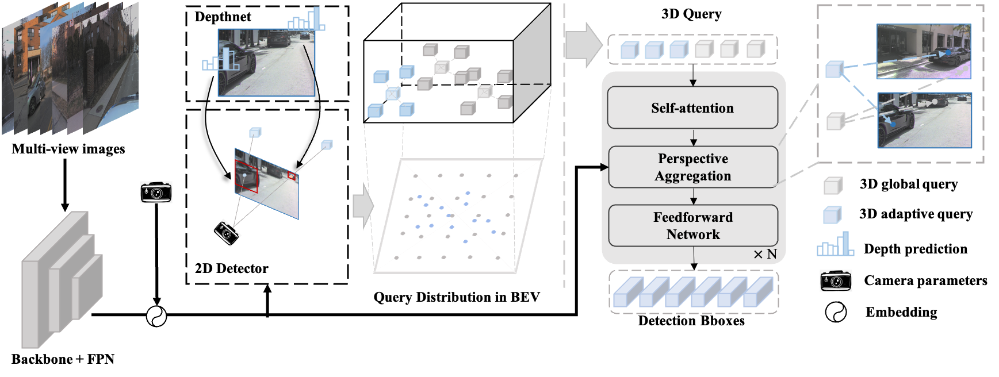

<div align="center">
<h1>Far3D</h1>
<h3> [AAAI2024] Expanding the Horizon for Surround-view 3D Object Detection </h3>
</div>

[](https://paperswithcode.com/sota/3d-object-detection-on-nuscenes-camera-only?p=far3d-expanding-the-horizon-for-surround-view)
[](https://arxiv.org/abs/2308.09616)

## Introduction

This repository is an official implementation of Far3D.


Expanding existing methods directly to cover long distances poses challenges such as heavy computation costs and unstable convergence. 
To address these limitations, we proposes a novel sparse query-based framework, dubbed Far3D. By utilizing high-quality 2D object priors, we generate 3D adaptive queries that complement the 3D global queries.
To efficiently capture discriminative features across different views and scales for long-range objects, we introduce a perspective-aware aggregation module. Additionally, we propose a range-modulated 3D denoising approach to address query error propagation and mitigate convergence issues in long-range tasks.

## News
- [2023/08/01] We release the paper on [Arxiv]((https://arxiv.org/abs/2308.09616)).  
- [2023/08/01] Far3D achieves comparable performance (31.6 mAP, 23.9 CDS) on long-range Argoverse2 dataset, as well as achieving SoTA performance (63.5 mAP, 68.7 NDS) on nuScenes Camera Only.

## Getting Started
Our pipeline follows [StreamPETR](https://github.com/exiawsh/StreamPETR), and you can follow [Get Started](./docs/get_started.md) step by step.
* If you have used StreamPETR before, it is easy to run Far3D without additional extensive installation.

Quick Train & Evaluation

Train the model
```angular2html
tools/dist_train.sh projects/configs/far3d.py 8 --work-dir work_dirs/far3d/
```
Evaluation
```angular2html
tools/dist_test.sh projects/configs/far3d.py work_dirs/far3d/iter_82548.pth 8 --eval bbox
```

## Results on Argoverse 2 Val Set.
| Model | Backbone | Input size | mAP | CDS | Config | Download |
| :---: | :---: | :---: | :---: | :---:| :---: | :---:|
| BEVStereo | VoV-99 | (960, 640) | 0.146 | 0.104 | -- | -- |
| SOLOFusion  | VoV-99 | (960, 640) | 0.149 | 0.106 | -- | -- |
| PETR | VoV-99 | (960, 640) |  0.176 | 0.122 | -- | -- |
| Sparse4Dv2  | VoV-99 | (960, 640) | 0.189 | 0.134 | -- | -- |
| StreamPETR | VoV-99 | (960, 640) | 0.203 | 0.146| -- | -- |
| Far3D | VoV-99 | (960, 640) | **0.244** | **0.181**| [config](projects/configs/far3d.py) | [model](https://github.com/megvii-research/Far3D/releases/download/v1.0/iter_82548.pth)/[log](https://github.com/megvii-research/Far3D/releases/download/v1.0/far3d.log)|

**Notes**
- [This config](projects/configs/far3d.py) can be used to reproduce the results on Argoverse 2.
- For nuScenes version, due to the inconsistent data and evaluation processes, we do not incorporate it to this repo. One can transfer our model part to StreamPETR repo for nuScenes dataset. 

## Acknowledgements

We thank these great works and open-source codebases:

* 3D Detection.  [StreamPETR](https://github.com/exiawsh/StreamPETR), [MMDetection3d](https://github.com/open-mmlab/mmdetection3d), [DETR3D](https://github.com/WangYueFt/detr3d), [PETR](https://github.com/megvii-research/PETR), [BEVFormer](https://github.com/fundamentalvision/BEVFormer), [SOLOFusion](https://github.com/Divadi/SOLOFusion), [Sparse4D](https://github.com/linxuewu/Sparse4D).


## Citation

If you find Far3D is useful in your research or applications, please consider giving us a star 🌟 and citing it by the following BibTeX entry.
```bibtex
@article{jiang2023far3d,
  title={Far3D: Expanding the Horizon for Surround-view 3D Object Detection},
  author={Jiang, Xiaohui and Li, Shuailin and Liu, Yingfei and Wang, Shihao and Jia, Fan and Wang, Tiancai and Han, Lijin and Zhang, Xiangyu},
  journal={arXiv preprint arXiv:2308.09616},
  year={2023}
}
```